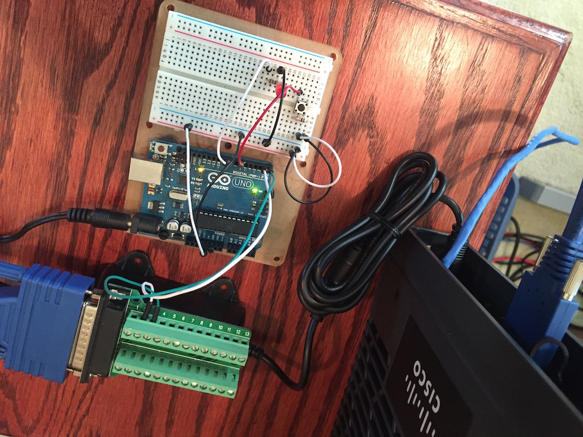
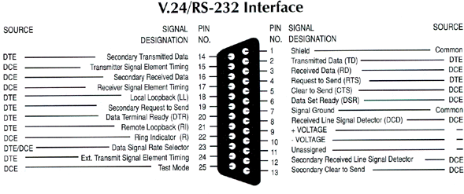
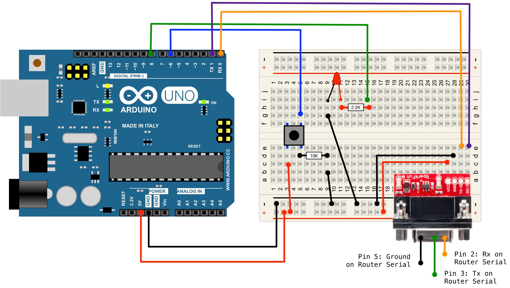

# ioxduino
IOx Proof of Concept to integrate a Cisco Router with an Arduino Microcontroller

### Table of Contents 

* [Background](#background)
* [Setup and PreRequisites](#setup_and_prerequisites)
* [Loading Demo Application](#loading_demo_application)
* [Running the Demo](#running_the_demo)

## Background

Many IOT applications involve reading details from sensors, processing the information, and taking some action.  This action could be data storage, sending an alert notification, or updating some other system.  This a isn't new processing flow, what is new with IOT is that this interaction takes place connected to the Internet, or perhaps just an Intranet.  

A challenges for the IOT application developer are: 

1. How to bridge the gap from what has been the serial communciation world of sensors, and the IP based Internet.  
2. Where to run the applications that the monitor and interact with the external sensors.  

Cisco looks to solve these challenges with the [Cisco IOx]() platform for Internet of Things applications.  Cisco has long been the leader in connecting people, applicaitons, business, etc to the Internet, and with IOx they now look to connect Things to the Internet.  

With IOx, application developers can run their IOT applications right at the edge of the network, close to the sensors and other devices (often called *Fog Computing*).  IOx Applications run directly on the Cisco Router that simulatneously provide the connectivity to the Internet or Intranet.  

## Arduino + Cisco IOx

[Arduino]() is an OpenSource, inexpensive, and easy to leverage microcontroller platform which can be easily used to interact with serial and digital components such as: 

* Temperature, Motion, Pressure, Light, etc Sensors 
* LED Lights for indictation
* Motors
* And many other "things"

Arduino is a great platform for building these electrical components and circuits, but lacks the horsepower to build complex applications.  

Cisco Routers and devices supporting IOx, provide the computing platform for running the application code, and includes serial (and other) interfaces for connecting to external devices like an Arduino.  

## ioxduino application 

ioxduino is provided as proof of concept code illustrating how such an application could be built leveraging IOx and an Arduino.  

In ioxduino, the external sensor running on the Arduino is a basic push button.  When the button is pressed the Arduino sends an event out the serial interface.  The serial interface on the Arduino is connected to a Serial Interface on the IOx Router, which is monitored by the IOx application code.  

When a button press is detected by the IOx application it updates a log that is available with a basic REST API call.  

# Setup and PreRequisites 

To build and replicate this demonstraiton you'll need access to an IOx device with a Serial Port, and a compatible Arduino device.  The original demonstration was created using a **Cisco C819HG-4G-G-K9** router and an **Arduino UNO**, however other models of each could be used.  

## IOx Router/Host 

[Cisco DevNet IOx Community]() is the best place for resources on developing with IOx.  Before beginning this, or any other IOx app project, you can find information on preparing your router.  This includes: 

* installing the correct IOS image 
* configuing IOS to enable IOx 
* loading the neccessary cartridges for running applications

This demonstration runs as a Python PaaS application, so follow the preperation for that demonstration.  

### Serial Port 

Because this demonstration uses the router's Serial Interface to connect to the Arduino, you'll need: 

* Additional configuration to enable the mapping of the Serial Interface to the IOx application
	* See this link for information 
* A compatible Serial cable for your router that exposes the TX/RX pins to conenct to the Arduino.  

#### SmartSerial Interface Cable Option

The Cisco C819HG-4G-G-K9 router, and several others, leverage a SmartSerial interface on the Serial Interface.  To leverage this port, you can order a SmartSerial to RS232/DB25 cable that can be used to gain access to a standard serial interface.  That cable coupled with a DB25 breakout board makes it very easy to interconnect with the Ardunio.  

**Sample Parts List**

| Description | Part Number | Sample Link |
| ----------- | ----------- | ----------- |
| SmartSerial to Female DB25 | CAB-SS-232FC | [Amazon](https://www.amazon.com/Cisco-Smart-Serial-Female-CAB-SS-232FC/dp/B0064CQWDW/ref=sr_1_1?ie=UTF8&qid=1473424993&sr=8-1&keywords=smart+serial+to+db25) |
| Male DB25 Breakout Board | N/A | [Amazon](https://www.amazon.com/Swellder-Connector-25-pin-Terminal-Breakout/dp/B00V7S79BW/ref=sr_1_2?s=electronics&ie=UTF8&qid=1473425100&sr=1-2&keywords=db25+breakout) |

*Links to Amazon above are purely for reference.  We will receive no money if you use them.*

For reference, here is an image showing the breakout of the pins on a standard DB25/RS232 port.  The pins that you'll need are **Pin 2 - Transmit** and **Pin 3 - Receive**.  These will be connected to the opposite pins on the Arduino.  

## Arduino 

The great part about the Arduino platform is the large number of boards to use that, for the most part, are compatible with each other, including sketchs (an Arduino program).  A common Ardunio to use for projects focused on learning and demonstrations is the Arduino UNO, which was used here.  

In addition to the Arduino board itself, you'll need a few other things to complete the external sensor circuit.  These include: 

* Push Button
* LED Light (for indication)
* Resistors (for LED and Pull Down on button)
* Breadboard (optional but very handy)
* Breadboard jumpers
* Arduino Power Supply

### Parts List 

The following parts list and links are provided for information and as a reference.  Any similar components will work.  

| Description | Link | 
| ----------- | ---- | 
| Arduino Uno | [Adafruit](https://www.adafruit.com/products/50) |
| Arduino Power Supply | [Adafruit](https://www.adafruit.com/products/63) |
| Arduino Uno USB Cable | [Adafruit](https://www.adafruit.com/products/62) |
| Breadboard | [Adafruit](https://www.adafruit.com/products/64) |
| Jumpers | [Adafruit](https://www.adafruit.com/products/153) |
| Button | [Adafruit](https://www.adafruit.com/products/367) |
| LED | [Adafruit](https://www.adafruit.com/products/299) |
| 2.2K Resistor - LED | [Adafruit](https://www.adafruit.com/products/2782) |
| 10K Resistor - Pull Down | [Adafruit](https://www.adafruit.com/products/2784) |

Alternatively, you can order an Arduino Starter Kit that includes the above and more.  

[Adafruit Arduino Starter Pack](https://www.adafruit.com/products/68)

*Links to Adafruit above are purely for reference.  We will receive no money if you use them.*

### Component Diagram 

# Loading Demo Application

## IOx PaaS Application

## Arduino Sample Sketch 

# Running the Demo

